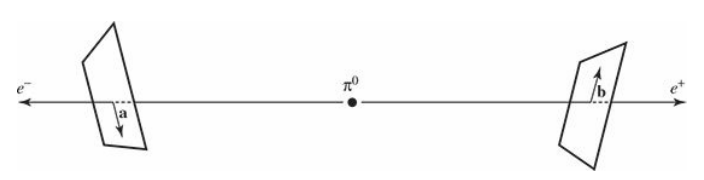

# Deriving Bell's Inequality

There is an elegant write-up on Bell's Inequality in the repository called BellsInequalityTheory.md which nicely lays down the historical and theoretical background of the EPR Paradox and the significance of Bell's Inequality. However, the inequality itself along with its derivation is missing. I would like to contribute to the project by filling in this crucial ingredient. I will be assuming that the reader has read the aforementioned document. I will also be using David Bohm's simplified version of the experiment (hence EPRB). Consider a (stationary) pion (spin zero) decaying into an electron and positron, which are spin-1/2 fermions.

$$\pi^0 \rightarrow e^- + e^+\$$

 Conservation of angular momentum quantum number stipulates that the two particles must have opposite spins, and therefore exist in a singlet state:

$$ \
|\psi\rangle = \frac{1}{\sqrt{2}} \left( | \uparrow \downarrow \rangle - | \downarrow \uparrow \rangle \right)
\ $$

Although it is not possible to know which particle has what spin before measurement, one thing is certain that they must have opposite spins. Suppose that these two particles, after getting produced, travel away in opposite directions, 20 light-years away from each other. A detector then measures the spin of the electron. This would instantaneously determine the positron's spin, where seemingly the information has travelled faster than the speed of light, hence the phrase "spooky action-at-a-distance".

Bell generalized the above situation by allowing the two detectors to measure the spins along arbitrary directions, as shown:

Denoting the average value of the *product* of the measured spins by $P(\mathbf{a},\mathbf{b})$, where **a** and **b** are the direction vectors along which the spins are measured, then quantum mechanically, we get:

$$ P(\mathbf{a}, \mathbf{b})=-\mathbf{a} \cdot \mathbf{b} $$

Now suppose that the hidden variable is $\lambda$ and the measurements of the spins of the particles are independent of the direction of the detectors of their corresponding antiparticles. This means that each particle's measurement outcome is governed by a function that depends on that particle's detector's direction vector and the hidden variable, i.e., $A(\mathbf{a},\lambda)$ and $B(\mathbf{b},\lambda)$, both of which can only take on +1 or -1 values. In particular, when $\mathbf{a} = \mathbf{b}$, then $A(\mathbf{a},\lambda) = - B(\mathbf{a},\lambda)$. Taking $\rho(\lambda)$ to be the probability density of the hidden variable, we can define the weighted average of the product of measurements as: $$P(\mathbf{a}, \mathbf{b})=\int \rho(\lambda) A(\mathbf{a}, \lambda) B(\mathbf{b}, \lambda) d \lambda$$

Using the perfect (anti)-correlation between $A$ and $B$, we get: $$P(\mathbf{a}, \mathbf{b})=-\int \rho(\lambda) A(\mathbf{a}, \lambda) A(\mathbf{b}, \lambda) d \lambda$$.

Now, pick **c** to be another unit vector. Then, using the above relations, we can write down:

$$\begin{aligned}
&P(\mathbf{a}, \mathbf{b})-P(\mathbf{a}, \mathbf{c})=-\int \rho(\lambda)[A(\mathbf{a}, \lambda) A(\mathbf{b}, \lambda)-A(\mathbf{a}, \lambda) A(\mathbf{c}, \lambda)] d \lambda\\
&\text {$\because$ }[A(\mathbf{b}, \lambda)]^2=1 \text { : }\\
&P(\mathbf{a}, \mathbf{b})-P(\mathbf{a}, \mathbf{c})=-\int \rho(\lambda)[1-A(\mathbf{b}, \lambda) A(\mathbf{c}, \lambda)] A(\mathbf{a}, \lambda) A(\mathbf{b}, \lambda) d \lambda
\end{aligned}$$

But $|A(\mathbf{a}, \lambda) A(\mathbf{b}, \lambda)|=1$ as discussed before regarding the unimodularity of $A$ and $B$. Additionally, $\text {} \rho(\lambda)[1-A(\mathbf{b}, \lambda) A(\mathbf{c}, \lambda)] \geq 0$

$$\therefore|P(\mathbf{a}, \mathbf{b})-P(\mathbf{a}, \mathbf{c})| \leq \int \rho(\lambda)[1-A(\mathbf{b}, \lambda) A(\mathbf{c}, \lambda)] d \lambda$$

And finally: $$|P(\mathbf{a}, \mathbf{b})-P(\mathbf{a}, \mathbf{c})| \leq 1+P(\mathbf{b}, \mathbf{c})$$

This is called Bell's Inequality. The beautiful thing about it is that it makes no assumptions regarding the hidden variable (except for locality). Thus, this is a powerful result that challenged, and later, by virtue of confirmation provided by the work of Aspect, Grangier, and Roger, ruled out the 'realist' position championed by the EPR paradox.

References: [1] Griffiths, David J. Introduction to Quantum Mechanics. 3rd ed., Pearson, 2018